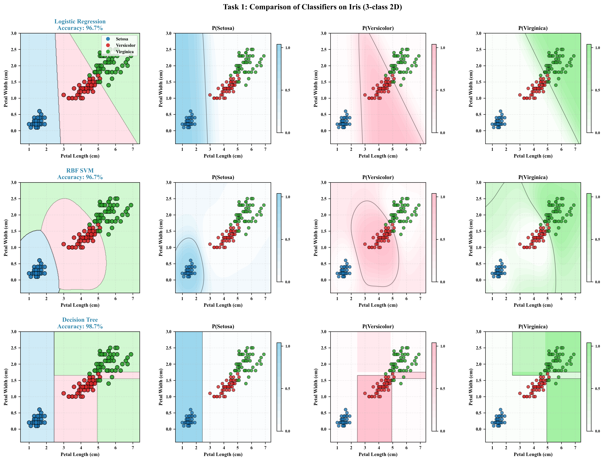
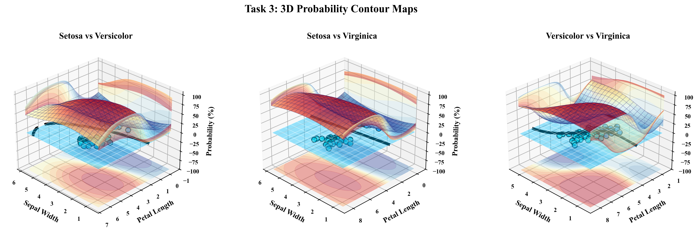
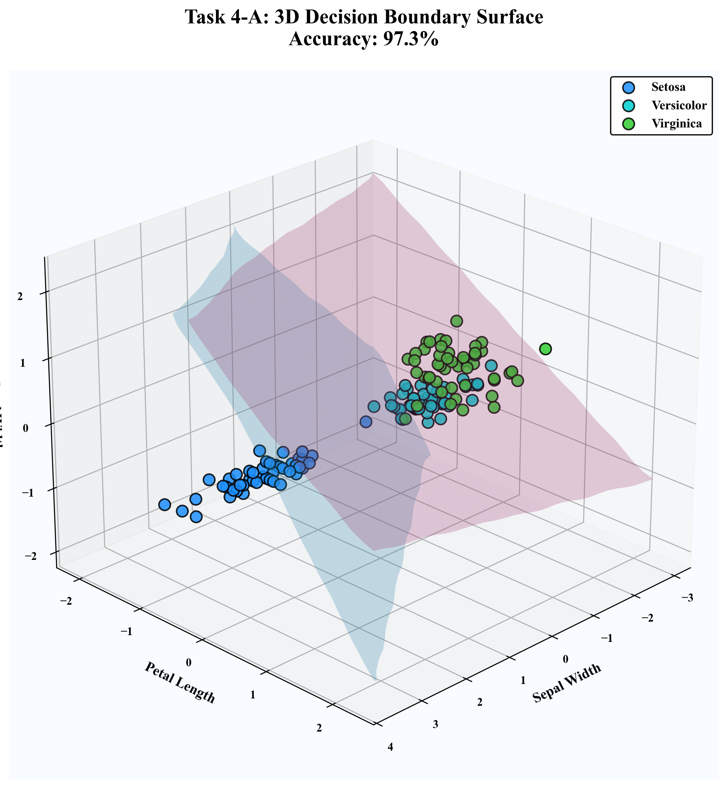
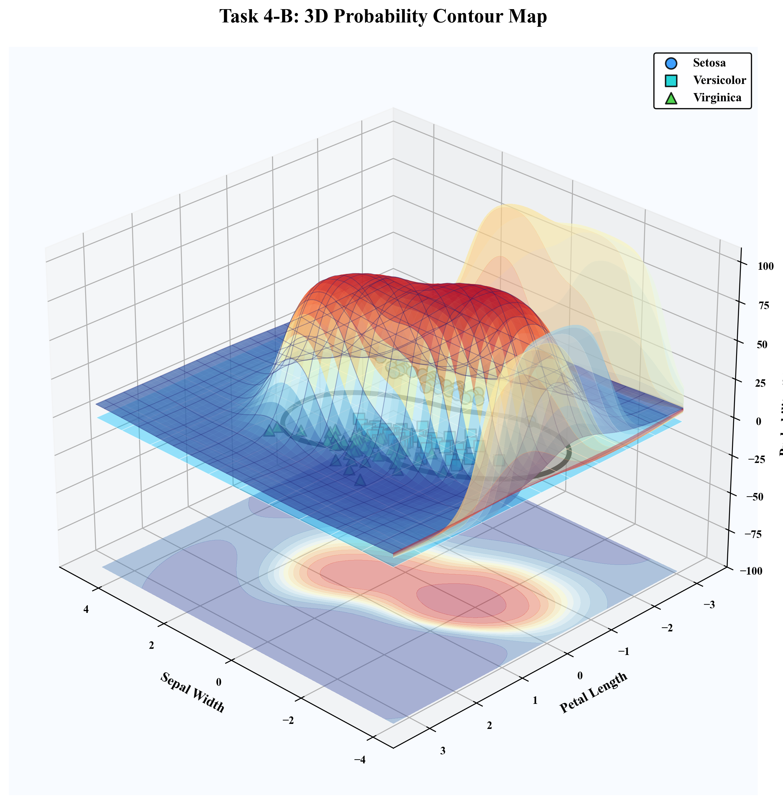

# 🚀 Iris Classification Visualization
## Multi-Dimensional Iris Dataset Classification System

---

## 🏆 News
- [Dec.12] Base Version Released

---

## 📋 Project Overview

This project is built with scikit-learn + matplotlib + plotly, constructing a complete visualization system featuring **2D / 3D / Multi-face Projections / Automatic Decision Surface Extraction** for in-depth analysis of the Iris dataset.

---

## ✨ Core Innovations

⭐ **Task 3**: Four-Face Coordinate Projection Probability System (Breaking Traditional 3D Visualization Limits)

⭐ **Task 4**: Marching Cubes Automatic Non-linear 3D Decision Boundary Extraction

🎨 **High-Quality Output**: PNG (300 DPI) + Plotly HTML (Fully Interactive)

---

## ⚙️ Installation & Run

### 1️⃣ Install Dependencies

The project provides requirements.txt with all dependencies:

▶ **Recommended (using Tsinghua Mirror)**
```bash
pip install -i https://pypi.tsinghua.edu.cn/simple -r requirements.txt
```

▶ **Or direct installation (default source)**
```bash
pip install -r requirements.txt
```

### 2️⃣ Run Scripts

▶ **Generate all static charts (PNG)**
```bash
python Project3.py
```

▶ **Generate Task 4 interactive HTML**
```bash
python task4_html.py
```

---

## 🎮 Task Descriptions

### ✨ Task 1: 2D Decision Boundary Comparison



**Features**: Petal Length × Petal Width  
**Algorithms**: Logistic Regression / SVM / Decision Tree

GridSpec implements a 3×4 matrix displaying decision boundaries + probability heatmaps for each classifier.

---

### 🎯 Task 2: 3D Binary Classification Plane (One-vs-One Decomposition)


**Features**: Sepal Width × Petal Length × Petal Width  
**Strategy**: One-vs-One (OvO)

Fits linear decision planes for three class pairs, comparing distribution and overlap regions.

---

### 🌟 Task 3: Probability Contour + Four-Face Projection (⭐Major Innovation)



**Innovation Highlights**:

- Four-face projections (bottom/left/right/front)
- Five-layer composite visualization (scatter, grid, probability field, contours, skeleton)
- Multi-angle observation of decision region probability structure
- Overcomes traditional 3D "occlusion" limitations

---

### 🚀 Task 4: Marching Cubes Multi-class Decision Volume

**4-A Decision Boundary**



**4-B Probability Contour**



**Features**: Three-dimensional feature space  
**Algorithm**: Marching Cubes (Automatic iso-surface extraction)

Demonstrates traditional OvO decomposition VS direct three-class non-linear boundaries.

---

## 🌐 Interactive HTML

Open for 360° operations:

The interactive 3D visualization is available via GitHub Pages:

👉 https://spinning888.github.io/Iris_data_visualisation/Task4_Interactive.html

No local environment is required.

| Operation | Function |
|-----------|----------|
| 🖱 Left Drag | Rotate view |
| 🖱 Scroll | Zoom |
| 🔍 Hover | Display coordinates |
| 🔘 Legend | Show/hide layers |
| ⬆ Export | Download image |

---

## 📁 File Structure

```
code/
├── Project3.py                      # Main script: Task1–Task4 PNG output
├── task4_html.py                    # Task 4 interactive HTML
├── requirements.txt                 # All dependencies
├── README.md                        # This file
├── Task1_Classifier_Comparison.png
├── Task2_Binary_Boundary.png
├── Task3_Probability_Contours.png
├── Task4_Decision_Boundary.png
├── Task4_Contour_Map.png
└── Task4_Interactive.html
```

---

## 🚀 Quick Start

```bash
# Step 1: Install dependencies
pip install -i https://pypi.tsinghua.edu.cn/simple -r requirements.txt

# Step 2: Generate static charts
python Project3.py

# Step 3: Generate interactive HTML
python task4_html.py
```

---

## 🌟 Features
⭐ Multi-face Probability Projection (Rare 3D → 4-face projection technique)

⭐ Marching Cubes Automatic Decision Surface Modeling (Non-linear boundaries)

🎨 High-resolution Multi-layer Composite Rendering

🌐 Fully Interactive 3D Visualization System

---

## ✨ Contacts

Any issues, feel free to contact the author:

📧 **Email:** [2024150065@mails.szu.edu.cn](mailto:2024150065@mails.szu.edu.cn)
